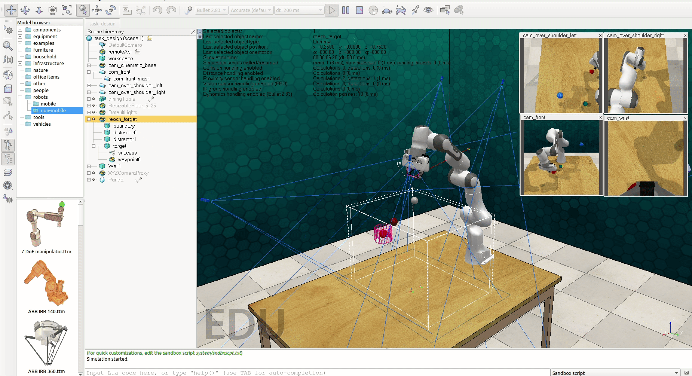
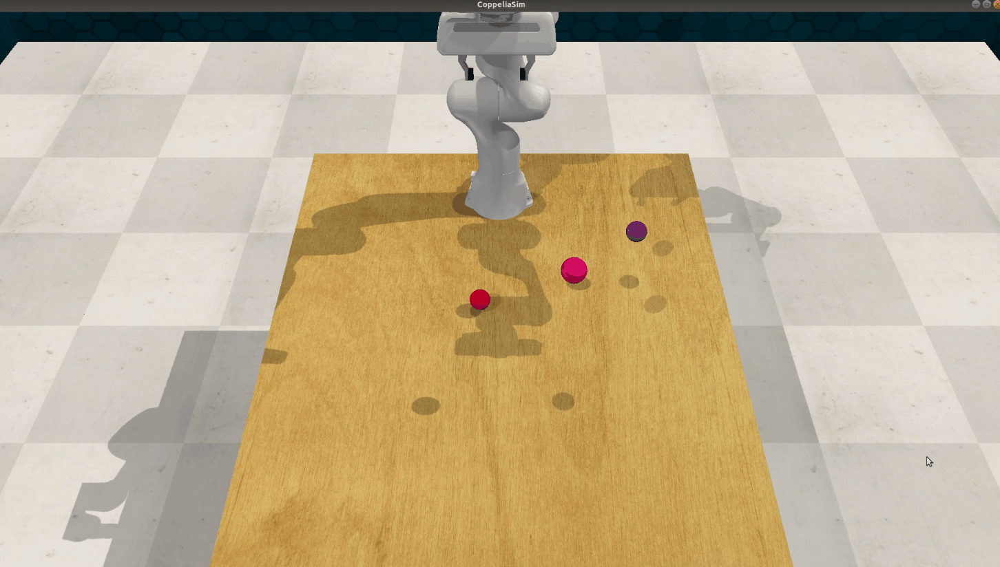

### Implementation of Reinforcement Learning  for Robot Arm

The implementation of reinforcement learning Algorithm TD3 for robot arm in RLBench Environment.

Current implementation is on reach target task, more tasks will be added in the future.


|  |  |
| :-------------------------: | :-------------------------: |
| RLBench Environment       | RLBench Gym Environment   |


### Dependencies

- Python 3.6
- Paddlepaddle >= 1.8.2
- [PARL](https://github.com/PaddlePaddle/PARL) >= 1.3.1
- [RLBench](https://github.com/stepjam/RLBench)
- [Pyrep](https://github.com/stepjam/PyRep)
- [CoppeliaSim](http://www.coppeliarobotics.com/) (previously called V-REP)

### Install
RLBench is built around PyRep and CoppeliaSim. First head to the [Pyrep](https://github.com/stepjam/PyRep) github page and install them.

After that, go to [RLBench](https://github.com/stepjam/RLBench) github repo and install it .

### Run

- To start  the training program with **gym GUI**

```
$ pip3 install -r requirements.txt
$ python train_gym.py --train --mode='human'
```

Render mode: `human`, `rgb_array` and `None`

To test agent

```
$ python train_gym.py --test --mode='human'
```


- To start  the training program with **RLBench GUI**

```
$ python train_rlbench.py --train
$ python train_rlbench.py --test
```

You can also run it headless with argument `--headless`


### TO DO

- [x]  RLBench with Gym Env
- [ ]  RLBench with Simple Task