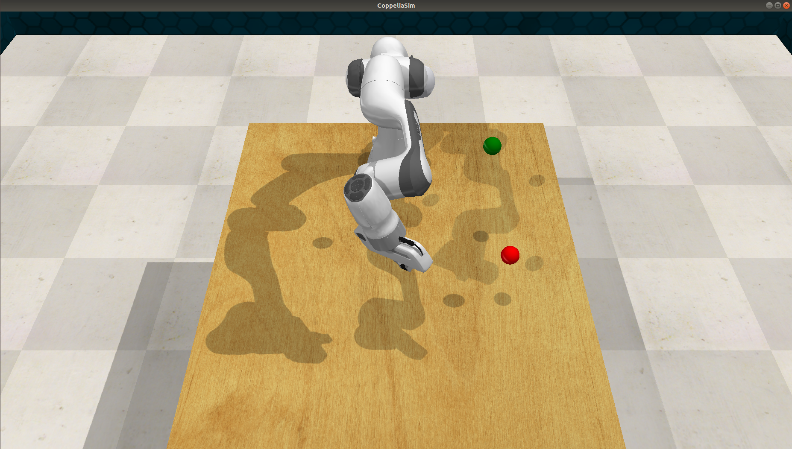

### Implementation of Reinforcement Learning  for Robot Arm

The implementation of reinforcement learning Algorithm TD3 for robot arm in RLBench Environment.



### Dependencies

- Python 3.6
- Paddlepaddle >= 1.8.2
- [PARL](https://github.com/PaddlePaddle/PARL) >= 1.3.1
- [RLBench](https://github.com/stepjam/RLBench)
- [Pyrep](https://github.com/stepjam/PyRep)
- [CoppeliaSim](http://www.coppeliarobotics.com/) (previously called V-REP)

### Install
RLBench is built around PyRep and CoppeliaSim. First head to the [Pyrep](https://github.com/stepjam/PyRep) github page and install them.

### Run

To start  the training program

```
$ python train_gym.py
```

